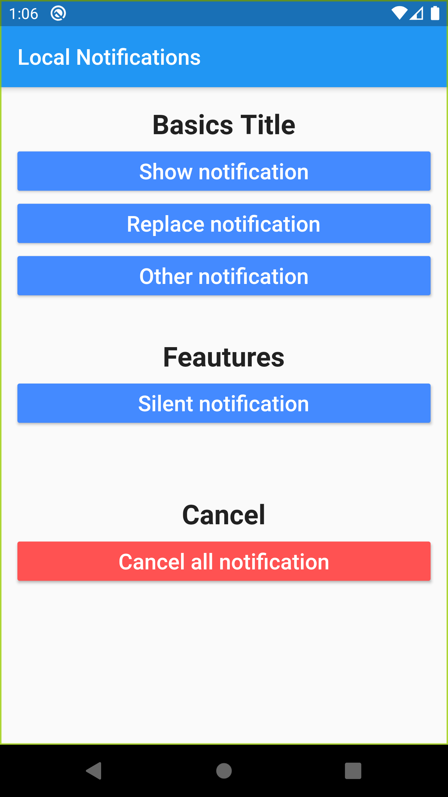

# localpushnotifications

A new Flutter application.

## Getting Started

This project is a starting point for a Flutter application.

* Create local push notifications Flutter application on Android & iOS.

- Implement the flutter_local_notifications.

- Integration in Android.

- Add buttons to send a differents local Notifications.

- Add Button to replace the local notification sended.

- Add button to delete all notifications.

- Make the notification deleted or canceled.

- Mute the sound of the local notification.

## Screen

## A few resources to get you started if this is your first Flutter project:

- Local Push Notification - Flutter :

    https://www.youtube.com/watch?v=xMeCwF5MO6w&list=PL1WkZqhlAdC9shbzjQao6cdzqB_Wu7Hr4